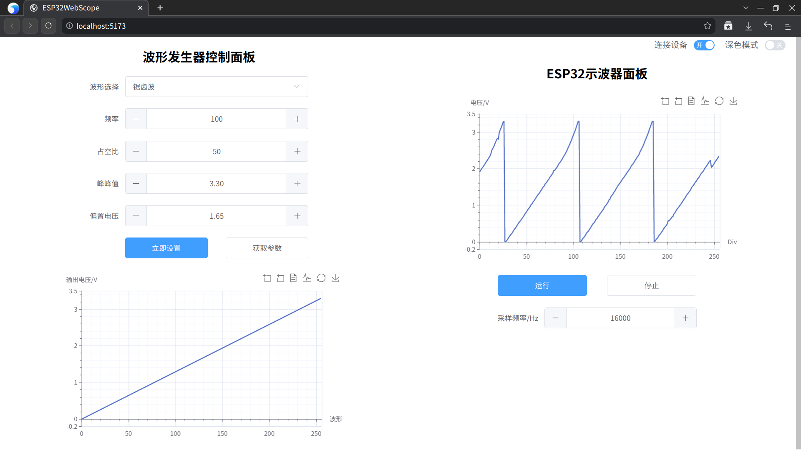

#ESP32WebScopeUI

### 简介

基于ESP32最小系统板制作的网页示波器+波形发生器，本仓库存放的是web界面代码

- 采用`vue3.0`+`vite3`+`ts`开发(新手边学边做的，代码很菜)
- 界面布局则采用了`element-plus`。
- 同时项目尝试了使用按需引入+自动导入的方式减少了编译后的文件体积
- 支持切换深色模式
- 通过websocket与ESP32通信

主界面如图所示：



### 编译及使用方法

首先克隆代码并安装依赖

```bash
yarn install
```

开发环境使用(带热更新)：

```bash
yarn run dev
```

在生产环境使用，编译并预览：

```bash
yarn run build
yarn run preview
```